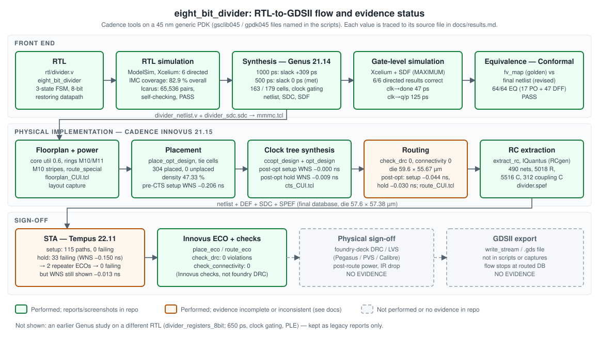
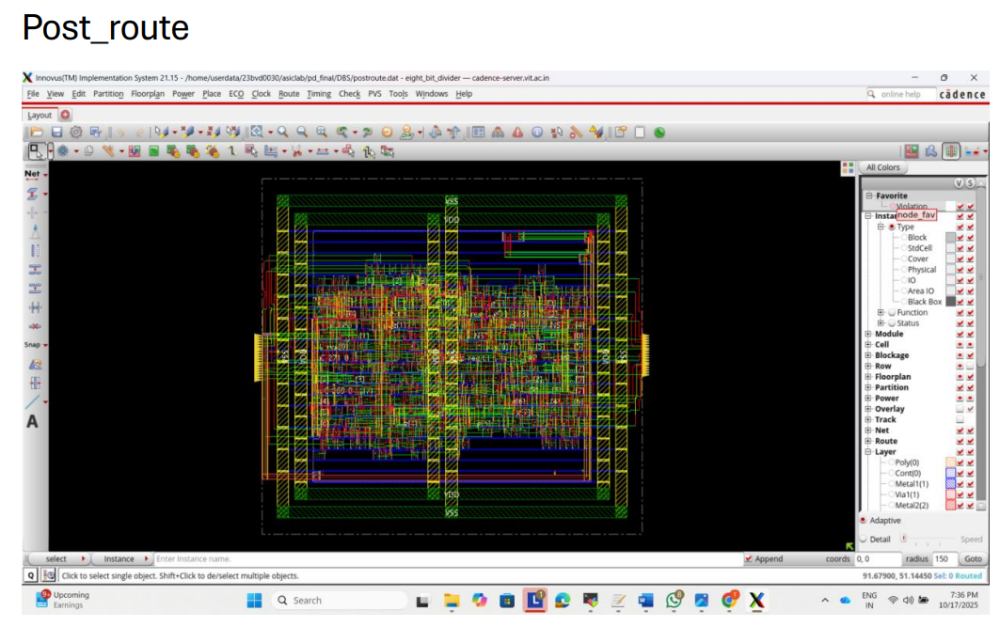

# 8-bit FSM Divider: RTL-to-GDSII ASIC Implementation

An 8-bit unsigned sequential divider (`eight_bit_divider`) controlled by a three-state FSM. The design is taken from Verilog RTL through functional verification, Cadence Genus synthesis, SDF-annotated gate-level simulation, Conformal equivalence checking, Cadence Innovus place-and-route, and Cadence Tempus static timing analysis with ECO hold fixing.


| Parameter | Value | Source |
| --------- | ----- | ------ |
| Function | Unsigned division: quotient `q = x / y`, remainder `p = x % y` | [`rtl/divider.v`](rtl/divider.v) |
| Operands / results | 8-bit `x`, 8-bit `y` → 8-bit `q`, 8-bit `p` | RTL ports |
| Algorithm | Radix-2 restoring division, one quotient bit per clock | RTL `DIVIDE` state |
| Control | 3-state FSM: `IDLE`, `DIVIDE`, `DONE`; `start` / `done` handshake | RTL `localparam` |
| Latency | 8 iteration cycles; `done` rises on the **9th** rising edge after the edge that samples `start` | RTL, Icarus and gate-level simulation |
| Divide by zero | `q = 0`, `p = x`, `done = 1` on the sampling edge | RTL, simulation |
| Flip-flops | 47 (48 declared bits; `c[8]` is constant 0) | Yosys, Conformal LEC |
| Synthesis (Genus) | 1000 ps clock: +309 ps worst slack · 500 ps clock: 0 ps worst slack | [`synthesis/reports/`](synthesis/reports/) |
| Gate-level sim | 6/6 directed results correct with SDF; clk→`done` 47 ps, clk→`q`/`p` 125 ps | [`verification/gls/`](verification/gls/) |
| Equivalence | Conformal LEC, Genus `fv_map` vs final netlist: 64/64 points EQ, PASS | [`verification/lec/`](verification/lec/) |
| Place and route | Innovus: floorplan → place → CTS → route; `check_drc` 0, `check_connectivity` 0 | [`physical-design/`](physical-design/) |
| Post-route STA | Tempus: 0 failing setup paths before ECO; hold reduced from 33 failing paths to 0 by two ECO rounds, **but the final capture still shows WNS −0.013 ns** (see [Limitations](#13-limitations-and-future-work)) | [`timing-analysis/`](timing-analysis/) |
| GDSII | **Not evidenced.** The flow ends at the routed Innovus database; no `write_stream` or `.gds` file exists | — |

---

## Contents

1. [Project overview](#1-project-overview)
2. [Divider architecture and operation](#2-divider-architecture-and-operation)
3. [FSM design](#3-fsm-design)
4. [RTL implementation](#4-rtl-implementation)
5. [Functional verification](#5-functional-verification)
6. [Synthesis using Cadence Genus](#6-synthesis-using-cadence-genus)
7. [Gate-level simulation and timing annotation](#7-gate-level-simulation-and-timing-annotation)
8. [Physical implementation using Cadence Innovus](#8-physical-implementation-using-cadence-innovus)
9. [Static timing analysis using Cadence Tempus](#9-static-timing-analysis-using-cadence-tempus)
10. [Timing constraints](#10-timing-constraints)
11. [Results and trade-offs](#11-results-and-trade-offs)
12. [Reproduction instructions](#12-reproduction-instructions)
13. [Limitations and future work](#13-limitations-and-future-work)

Repository layout, provenance and the evidence index are at the [end of this page](#repository-structure).

---

## 1. Project overview

A combinational array divider needs one subtract stage per quotient bit, all in series. A sequential divider reuses a single 9-bit subtractor for eight clock cycles. A small FSM loads the operands, counts the iterations and reports completion. This project implements that design and takes it through a Cadence ASIC flow on a 45 nm generic PDK (the scripts name `gsclib045` LEFs, `gpdk045` QRC tech and `*_basicCells` multi-Vt libraries).



Each stage is labelled by evidence. Green stages have reports or screenshots in this repository. Amber stages were run, but their evidence is incomplete or inconsistent. Dashed stages have no evidence and are not claimed.

| Stage | Tool | Status | Details |
| ----- | ---- | ------ | ------- |
| RTL design | Verilog-2001 | Done | [docs/rtl-design.md](docs/rtl-design.md) |
| RTL simulation and coverage | ModelSim, Xcelium, IMC, Icarus | Done | [docs/verification.md](docs/verification.md) |
| Logic synthesis | Genus 21.14 | Done (1000 ps and 500 ps runs) | [docs/synthesis.md](docs/synthesis.md) |
| Gate-level simulation with SDF | Xcelium, SimVision | Done | [docs/verification.md](docs/verification.md#4-gate-level-simulation) |
| Logical equivalence check | Conformal LEC | Done (`fv_map` vs final netlist) | [docs/verification.md](docs/verification.md#5-logical-equivalence-check) |
| Floorplan, placement, CTS | Innovus 21.15 | Done | [docs/physical-design.md](docs/physical-design.md) |
| Routing | Innovus 21.15 | Done; timing not closed in Innovus | [docs/physical-design.md](docs/physical-design.md#5-routing) |
| RC extraction, post-route STA, ECO | Innovus, Tempus 22.11 | Done; hold closure not fully demonstrated | [docs/timing-analysis.md](docs/timing-analysis.md) |
| Foundry DRC/LVS, power and IR sign-off | — | Not evidenced | — |
| GDSII stream-out | — | Not evidenced | — |

## 2. Divider architecture and operation


The datapath has four state registers and three output registers:

| Register | Width | Role |
| -------- | ----: | ---- |
| `a` | 8 | Loaded with the dividend `x`; shifts left once per iteration and collects quotient bits in `a[0]` |
| `b` | 8 | Holds the divisor `y` for the whole operation |
| `c` | 9 | Partial remainder (accumulator) |
| `count` | 4 | Iteration counter, 0 … 8 |
| `state` | 2 | FSM state |
| `q`, `p`, `done` | 8, 8, 1 | Registered outputs |

Each `DIVIDE` cycle performs one radix-2 **restoring** division step:

```text
shifted = {c[7:0], a[7]}          // shift the next dividend bit into the remainder
a       = {a[6:0], 0}
diff    = shifted - {0, b}        // 9-bit trial subtraction
if diff[8] (negative):  c = shifted, a[0] = 0   // restore
else:                   c = diff,    a[0] = 1
count   = count + 1
```

After eight steps, `a` holds the quotient and `c[7:0]` the remainder. These are copied into `q` and `p` and `done` is raised. More detail: [docs/architecture.md](docs/architecture.md).


*The timing diagram is redrawn from the gate-level SimVision waveform. The RTL simulation shows the same cycle behaviour.*

## 3. FSM design

| State | Encoding | Behaviour | Next state |
| ----- | -------- | --------- | ---------- |
| `IDLE` | `2'b00` | Entered only on reset. `done ← 0` | `start && y != 0` → `DIVIDE` (load `a←x`, `b←y`, `c←0`, `count←0`, `q,p←0`) · `start && y == 0` → `DONE` (`q←0`, `p←x`, `done←1`) · otherwise stay |
| `DIVIDE` | `2'b01` | `count < 8`: one shift/subtract/restore step, `count+1`. `start` is ignored | `count == 8` → `DONE` (`q←a`, `p←c[7:0]`, `done←1`) |
| `DONE` | `2'b10` | Holds `q`, `p` and `done = 1` | `start && y != 0` → `DIVIDE` (reload, `done←0`) · `start && y == 0` → stay (`q←0`, `p←x`) · otherwise stay |

**Cycle count.** Call the rising edge that samples `start` edge 0. Edges 1–8 run the eight iterations (`count` 0 → 8). Edge 9 sees `count == 8`, loads `q`/`p` and sets `done`. The "8-cycle" description therefore refers to the 8 iteration cycles. The externally visible latency from `start` to `done` is 9 clock cycles, and the next operation can start on the following cycle. The self-checking testbench verifies this latency for all 65,280 non-zero divisors. Details: [docs/rtl-design.md](docs/rtl-design.md#3-fsm).

## 4. RTL implementation

- File: [`rtl/divider.v`](rtl/divider.v), module `eight_bit_divider`. This is the only divider RTL in the repository and the module that every Cadence script elaborates (`elaborate eight_bit_divider`, `-root eight_bit_divider`).
- Ports: `clk`, `rst` (asynchronous, active-high), `start`, `x[7:0]`, `y[7:0]` → `q[7:0]`, `p[7:0]`, `done`.
- Style: one `always @(posedge clk or posedge rst)` block. Next-state values are computed with blocking assignments into `*_next` temporaries, and registers are updated with non-blocking assignments.
- The RTL was carried over byte-for-byte from the original upload. No functional or stylistic edits were made during consolidation.
- Yosys (`make -C verification lint`) reports 0 problems and infers 47 flip-flops with enable and asynchronous reset.

## 5. Functional verification

| Test | Tool | Scope | Result |
| ---- | ---- | ----- | ------ |
| Directed testbench [`tb_divider_8bit.v`](verification/testbench/tb_divider_8bit.v) | ModelSim, Xcelium (original); Icarus (re-run) | 6 cases incl. divide-by-zero, prints results | All 6 match `x/y`, `x%y`; divide-by-zero returns `q=0`, `p=x` ([transcript](verification/simulation/rtl/modelsim_transcript.png)) |
| Exhaustive self-checking testbench [`tb_divider_exhaustive.v`](verification/testbench/tb_divider_exhaustive.v) (added in this consolidation) | Icarus Verilog 12 | All 65,536 `(x, y)` pairs; 9-edge latency; result hold; `start` ignored in `DIVIDE`; async reset mid-operation | **TEST PASSED**, 65,538 operations, 0 errors |
| Code/FSM coverage | Cadence IMC | Directed test | Overall 82.9 %, DUT 83.86 %, block 92.86 %, toggle 69.31 %, FSM 87.5 % ([capture](verification/simulation/rtl/imc_coverage.png)) |

The exhaustive testbench was checked against two deliberately broken copies of the RTL (7 iterations instead of 8; wrong divide-by-zero remainder). It reported 130,307 and 255 errors respectively, so its checks do detect faults.

## 6. Synthesis using Cadence Genus

Script: [`synthesis/scripts/genus_script.tcl`](synthesis/scripts/genus_script.tcl). It reads the 12 slow/fast `vdd1v0`/`vdd1v2` HVT/SVT/LVT libraries, elaborates `eight_bit_divider`, enables clock-gating insertion, runs `syn_generic` → `syn_map` → `syn_opt` at medium effort, and writes the netlist, SDC, SDF and an LEC dofile.

| Metric (module `eight_bit_divider`, `PVT_1P1V_0C`) | 1000 ps clock | 500 ps clock |
| ------------------------------------------------- | ------------: | -----------: |
| Worst setup slack (CLOCK group) | **+309 ps** (308.6) | **0 ps** (0.3) |
| Critical path | `a_reg[7]` → `c_reg[4]`, 575 ps data path | `b_reg[1]` → `c_reg[1]`, 388 ps data path |
| Leaf cells (sequential / combinational) | 163 (51 / 112) | 179 (51 / 128) |
| Cell area (units of the library) | 511.974 | 524.286 |
| Total power | 226.390 µW | 463.658 µW |
| Leakage power | 28.735 nW | 54.086 nW |
| Clock-gating instances | 4 | 4 |

The 51 sequential instances are the 47 flip-flops plus the 4 inserted clock gates. Full tables, including the per-category power breakdown: [docs/synthesis.md](docs/synthesis.md).

An earlier synthesis study on a **different** RTL module, `divider_registers_8bit` (650 ps clock; baseline, clock-gated and physical-aware PLE runs), came from the source repository. Its RTL is not available. Its reports are kept separately in [`synthesis/reports/legacy_divider_registers_8bit/`](synthesis/reports/legacy_divider_registers_8bit/) and are never mixed with `eight_bit_divider` results.

## 7. Gate-level simulation and timing annotation

The Genus netlist was simulated in Xcelium with the testbench [`tb_eight_bit_divider_gls.v`](verification/gls/tb_eight_bit_divider_gls.v), which back-annotates `outputs/delays.sdf` (written by Genus `write_sdf`) at the MAXIMUM corner. The command is `xrun -timescale 1ns/10ps -f filelist_gls -access +rwc -gui` ([`run_gls`](verification/gls/run_gls)).

- All six directed operations give the correct quotient and remainder, and the 9-edge latency matches the RTL ([waveform](verification/gls/reports/02_waveforms.png)).
- Measured at the 145 ns edge: clock → `done` = **47 ps**, clock → `q`/`p` = **125 ps** ([done](verification/gls/reports/04_done_delay.png), [outputs](verification/gls/reports/05_output_delay.png)).
- Conformal LEC ([`divider_lec.do`](verification/lec/divider_lec.do)) compared Genus's intermediate `fv_map` netlist (golden) against the final netlist (revised). All 64 compare points (17 primary outputs + 47 DFFs) are equivalent: **PASS** ([report](verification/lec/reports/08_lec_output_2.png)). This shows that synthesis optimisation preserved the logic. It is **not** an RTL-to-netlist equivalence proof.

The netlist used for GLS and LEC is not stored in the repository, and its synthesis clock (1000 ps or 500 ps) is not recorded.

## 8. Physical implementation using Cadence Innovus

Scripts: [`physical-design/scripts/`](physical-design/scripts/), consisting of `mmmc.tcl` (wc = slow libraries, bc = fast libraries, one RC corner) and `floorplan_CUI.tcl`, `place_CUI.tcl`, `cts_CUI.tcl`, `route_CUI.tcl`.

| Step | Key commands | Result (Innovus `time_design` / checks) |
| ---- | ------------ | --------------------------------------- |
| Floorplan + power | `create_floorplan` (aspect 1, density 0.6, 8 µm margins), Metal10/11 core rings, Metal10 stripes, `route_special` | [Floorplan capture](physical-design/layout/01_floorplan.png) |
| Placement | `place_opt_design`, tie-cell insertion | 304 instances placed, 0 unplaced, density 47.33 %. Pre-CTS setup WNS −0.206 ns (9 paths); hold WNS −0.241 ns (115 paths) |
| CTS | `ccopt_design` with CLKBUF/CLKINV cells, 2W2S shielded clock routes, then `opt_design -post_cts` (setup and hold) | Before optimisation: setup +0.007 ns, hold −0.101 ns (113 paths). After: setup −0.000 ns (1 path), hold −0.009 ns (3 paths) |
| Routing + post-route opt | `route_design` (SI on, antenna diode insertion), `opt_design -post_route -setup -hold` | Before optimisation: setup −0.039 ns (8 paths), hold −0.030 ns (26 paths). After: setup −0.044 ns (9 paths), hold −0.030 ns (25 paths), density 62.33 % |
| Physical checks | `check_drc`, `check_connectivity -type all` | 0 DRC violations, 0 connectivity violations; die 59.6 × 55.67 µm |



Timing was **not** closed inside Innovus: the routed database still had small setup and hold violations. Closure was attempted in Tempus with ECOs (next section). Per-step screenshots: [docs/physical-design.md](docs/physical-design.md).

## 9. Static timing analysis using Cadence Tempus

The routed design (netlist, DEF, SDC, SPEF) was loaded into Tempus 22.11 with OCV and CPPR enabled ([`tempus_script.tcl`](timing-analysis/scripts/tempus_script.tcl)).

| Iteration | Setup | Hold | Evidence |
| --------- | ----- | ---- | -------- |
| Initial post-route | 115 paths, 0 failing ([capture](timing-analysis/reports/eco/00_setup_summary_0_failing.png)) | 33 failing; WNS −0.150 ns, TNS −1.425 ns | [capture](timing-analysis/reports/eco/01_initial_hold_33_failing.png) |
| ECO 1: `tempuszero.tcl` (25 `eco_add_repeater` buffers visible) → `place_eco`/`route_eco` in Innovus | — | 14 failing; WNS −0.013 ns, TNS −0.074 ns | [script](timing-analysis/reports/eco/02_tempuszero_eco_script.png), [capture](timing-analysis/reports/eco/03_after_eco1_hold_14_failing.png) |
| ECO 2: `tempuszero2.tcl` (19 buffers / `DLY1X1` delay cells visible) | not re-captured after the ECOs | Capture shows **0 failing / 114 passing, but WNS −0.013 ns and TNS −0.074 ns** | [script](timing-analysis/reports/eco/04_tempuszero2_eco_script.png), [capture](timing-analysis/reports/final_setup_hold_summary.png) |

`report_analysis_coverage` lists 47/47 setup checks, 47/47 hold checks and 17/17 external-delay checks met. It also lists 4 of 8 clock-gating checks and 47 of 149 pulse-width checks as untested. The final database passed `check_drc` and `check_connectivity` with 0 violations (die 57.6 × 57.38 µm).

**Read this result with care.** The "hold = 0" capture has the same timestamp (19:38) and the same WNS/TNS as the ECO-1 capture with 14 failing paths. A negative WNS together with zero failing paths is contradictory. Hold closure is therefore **not proven** by the available evidence. Details and other caveats: [docs/timing-analysis.md](docs/timing-analysis.md).

## 10. Timing constraints

| File | Period | Input / output delay (max) | Clock latency (source + network) | Uncertainty (setup = hold) | Used for |
| ---- | -----: | -------------------------: | -------------------------------: | -------------------------: | -------- |
| [`constraints/divider_1000ps.sdc`](constraints/divider_1000ps.sdc) | 1.0 ns | 0.5 / 0.5 ns | 0.25 + 0.25 ns | 0.1 ns | Genus 1000 ps run |
| [`constraints/divider_500ps.sdc`](constraints/divider_500ps.sdc) | 0.5 ns | 1.0 / 0.25 ns | 0.25 + 0.25 ns | 0.1 ns | Genus 500 ps run |

Both files also set a 50 ps clock transition, minimum latencies and I/O delays, path groups (`CLOCK`, `INPUTS`, `OUTPUTS`, `COMBO`), max transition 0.2, max fanout 20 and max capacitance 80. The **1 ns target** is confirmed by `divider_1000ps.sdc` and by the 1000 ps Genus QoR report. Innovus and Tempus read the SDC that Genus wrote (`divider_sdc.sdc`). The captures do not record which of the two runs produced it. Known issues in these files are listed in [docs/synthesis.md](docs/synthesis.md#3-constraints).

## 11. Results and trade-offs

- **Speed vs power.** Halving the clock period from 1000 ps to 500 ps raised total power from 226.4 µW to 463.7 µW (×2.05, consistent with dynamic power scaling with frequency). Area grew by 2.4 % (511.97 → 524.29) and there were 16 more combinational cells. The 500 ps critical path is built mostly from LVT cells (`DFFRHQX1LVT`, `OAI2BB1X1LVT`, `ADDFX1LVT`), while the 1000 ps path uses mainly standard-Vt and HVT cells. Leakage roughly doubles (28.7 → 54.1 nW).
- **Latency vs area.** A single 9-bit subtractor reused over 8 cycles keeps the design to 163–179 cells. The cost is a 9-cycle latency and one result at a time.
- **Where power goes.** At both clock periods, registers draw about 67 % of total power and the clock network about 12 %. Internal (short-circuit + internal-node) power is 87 % of the total. Clock gating (4 ICGs) helps only the registers that have a load enable.
- **Hold dominates post-layout.** Setup met with margin in Tempus, but hold needed two rounds of buffer/delay-cell ECO. Most of the initially failing hold paths run from output registers straight to ports (`q_reg` → `q`, `p_reg` → `p`), and the ECO scripts add buffers and `DLY1X1` delay cells on exactly those nets.

Every number with its source file: [docs/results.md](docs/results.md).

## 12. Reproduction instructions

**Open-source RTL checks (no licence needed):**

```sh
sudo apt-get install iverilog yosys     # Icarus Verilog 12, Yosys 0.33 used here
make -C verification sim                # original 6-case directed testbench
make -C verification exhaustive         # 65,536-pair self-checking testbench
make -C verification lint               # Yosys synthesis check + cell stats
```

**Cadence flow** (needs licensed Genus, Xcelium, Conformal, Innovus and Tempus, plus the 45 nm GPDK libraries, which are not included). The execution order, working-directory layout and file hand-offs between tools are in [docs/reproduction.md](docs/reproduction.md):

1. Genus: `genus -f synthesis/scripts/genus_script.tcl` → `divider_netlist.v`, `divider_sdc.sdc`, `outputs/delays.sdf`
2. Xcelium GLS: `verification/gls/run_gls` with the netlist, cell models and GLS testbench
3. Conformal: `lec -dofile verification/lec/divider_lec.do`
4. Innovus: load `mmmc.tcl`, then `floorplan_CUI.tcl` → `place_CUI.tcl` → `cts_CUI.tcl` → `route_CUI.tcl` → `extract_rc` / write netlist, DEF, SPEF
5. Tempus: `tempus -files timing-analysis/scripts/tempus_script.tcl`, then ECO (`write_eco`) → Innovus `place_eco` / `route_eco`

## 13. Limitations and future work

**Limitations and open issues**

- **No GDSII.** No `write_stream` command, `.gds` file or stream-out log exists. The flow is evidenced up to a routed, extracted and STA-analysed Innovus database, so this repository does not claim a completed GDSII.
- **No foundry sign-off.** DRC and connectivity come from Innovus `check_drc` / `check_connectivity`, not from a sign-off DRC/LVS deck. There is no post-route power or IR-drop analysis.
- **Hold closure not proven.** The final Tempus capture shows 0 failing paths but WNS −0.013 ns (see §9).
- **Two P&R databases.** The Task-4 step-by-step captures (die 59.6 × 55.67 µm, `pd_final`) and the Task-5 final database used for Tempus (die 57.6 × 57.38 µm, `pd_divider`) come from different Innovus runs.
- **Missing or mismatched files.** The uploaded `route_CUI.tcl` was a byte-for-byte copy of `cts_CUI.tcl`. The real routing script was recovered by transcribing the Task-4 lab report capture. The stored SPEF (344 nets, 26 Sep 2025, pre-ECO) is not the 490-net extraction used in Tempus. The ECO scripts exist only as screenshots. The Genus netlist, SDF and DEF are not stored.
- **Constraint inconsistencies.** `divider_1000ps.sdc` excludes a non-existent port `wb_clk_i` (so `clk` also receives an input delay). In `divider_500ps.sdc`, the 1.0 ns input delay cannot be reconciled with the positive INPUTS slack in its QoR report.
- **Verification scope.** LEC is `fv_map`-to-netlist, not RTL-to-netlist. GLS covers 6 directed vectors and is checked visually.
- **Interface.** Unsigned operands only. There is no divide-by-zero flag, and no new operation can be accepted while one is in `DIVIDE`.

**Future work**

- Re-run routing with `route_CUI.tcl`, close hold with real margin, and archive the text reports, not only screenshots.
- Add `write_stream` with the GPDK layer map, then sign-off DRC/LVS (Pegasus/PVS) and post-route power/IR analysis.
- Run RTL-to-netlist LEC using the `rtl_to_final.tcl` dofile that the Genus script already writes.
- Run the exhaustive self-checking testbench on the SDF-annotated netlist.
- Fix the SDC issues, register the I/Os, and explore a radix-4 or non-restoring datapath to reduce latency.

---

## Repository structure

```text
.
├── README.md
├── rtl/divider.v                       eight_bit_divider (the only divider RTL)
├── verification/
│   ├── Makefile                        Icarus/Yosys targets: sim, exhaustive, lint
│   ├── testbench/                      directed TB (original) + exhaustive self-checking TB
│   ├── simulation/rtl/                 ModelSim/Xcelium waveforms, transcript, IMC coverage
│   ├── gls/                            GLS testbench (SDF), run_gls, waveform/delay captures
│   └── lec/                            Conformal dofile + result captures
├── constraints/                        divider_1000ps.sdc, divider_500ps.sdc
├── synthesis/
│   ├── scripts/genus_script.tcl
│   └── reports/                        eight_bit_divider_1000ps/, _500ps/, legacy_divider_registers_8bit/
├── physical-design/
│   ├── scripts/                        mmmc.tcl, floorplan_CUI.tcl, place_CUI.tcl, cts_CUI.tcl, route_CUI.tcl
│   ├── reports/                        floorplan/, place/, cts/, route/, final_db/
│   └── layout/                         floorplan, post-CTS, post-route captures
├── timing-analysis/
│   ├── scripts/tempus_script.tcl
│   └── reports/                        SPEF, RC extraction, Tempus summaries, eco/
├── docs/                               architecture, rtl-design, verification, synthesis,
│   │                                   physical-design, timing-analysis, results, reproduction
│   ├── lab-reports/                    original Task 2–5 lab reports (.docx/.pdf) + summary
│   └── archive/                        full snapshot of RTL-of-8-bit-Divider + old README (superseded)
└── assets/                             divider-architecture.svg, rtl-to-gds-flow.svg, cycle-operation.svg
```

Report files are screenshots of tool output from the original runs; their content is unedited.

## Provenance

This repository consolidates two earlier repositories by the same author:

- **`Tanisha110705/ASIC-implementation-of-8-bit-divider`** (this repository): RTL, directed testbench, Genus script and reports, SDC files, Innovus scripts and captures, Tempus script, SPEF, GLS/LEC captures.
- **`Tanisha110705/RTL-of-8-bit-Divider`**: GLS testbench with `$sdf_annotate`, `run_gls`, Conformal dofile, `.gitignore`, the cycle-timing diagram, and the Genus study of `divider_registers_8bit`. Its own `rtl/` folder was an empty placeholder, so it contributed no RTL.

The author's original ASIC Design Lab reports (BEVD301P, Fall 2025-26, Tasks 2–5) are in [`docs/lab-reports/`](docs/lab-reports/README.md), with a summary of each. Every number in this README was cross-checked against them. Two things were recovered from them: the ECO captures in `timing-analysis/reports/eco/` (from the Task 5 report), and the real routing script `route_CUI.tcl` (from the Task 4 report). A complete snapshot of `RTL-of-8-bit-Divider` is kept in [`docs/archive/`](docs/archive/README.md), so nothing from it is lost. File-level mapping: [docs/reproduction.md](docs/reproduction.md#provenance-file-map).
