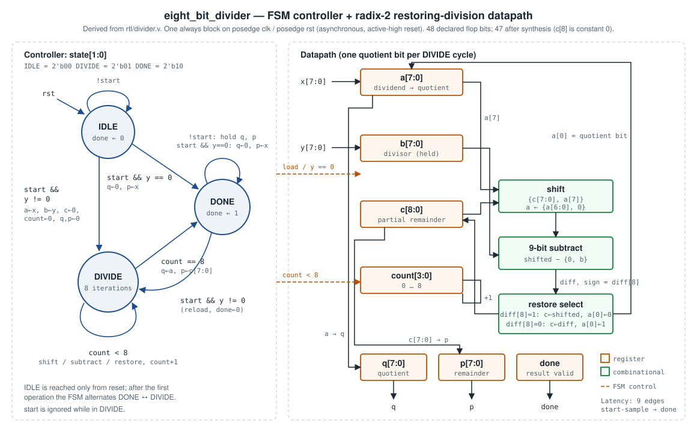
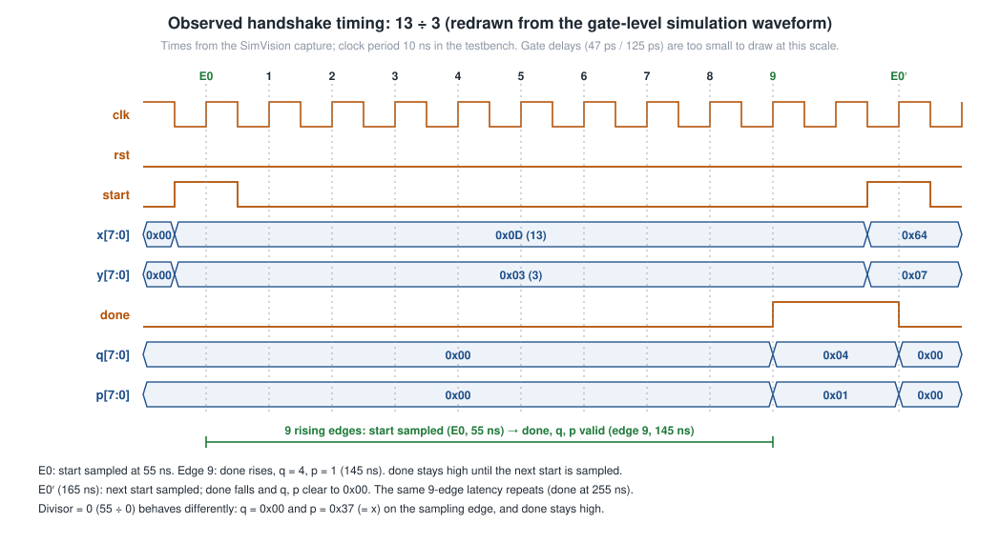

# Architecture

Source of truth: [`rtl/divider.v`](../rtl/divider.v) (module `eight_bit_divider`). Everything below is read from that file and checked by simulation ([verification.md](verification.md)).

## 1. Interface

| Port | Dir | Width | Description |
| ---- | --- | ----: | ----------- |
| `clk` | in | 1 | Clock. All state changes happen on the rising edge |
| `rst` | in | 1 | Asynchronous, active-high reset. Clears every register, including `q`, `p`, `done` and `state` (→ `IDLE`) |
| `start` | in | 1 | Request a division. Sampled in `IDLE` and `DONE`; ignored in `DIVIDE` |
| `x` | in | 8 | Dividend (unsigned) |
| `y` | in | 8 | Divisor (unsigned) |
| `q` | out (reg) | 8 | Quotient |
| `p` | out (reg) | 8 | Remainder |
| `done` | out (reg) | 1 | High when `q`/`p` hold a valid result; stays high until the next accepted `start` |

`x` and `y` are sampled only on the `start` edge. `x` is copied into `a` and `y` into `b`, so the inputs may change while the division runs.

## 2. Datapath

| Register | Bits | Reset | Load (on accepted `start`, y ≠ 0) | Per `DIVIDE` iteration |
| -------- | ---: | ----- | --------------------------------- | ---------------------- |
| `a` | 8 | 0 | `x` | `{a[6:0], qbit}` |
| `b` | 8 | 0 | `y` | unchanged |
| `c` | 9 | 0 | 0 | `restore ? {c[7:0],a[7]} : {c[7:0],a[7]} − b` |
| `count` | 4 | 0 | 0 | `count + 1` |
| `q` | 8 | 0 | 0 | — (loaded with `a` when `count == 8`) |
| `p` | 8 | 0 | 0 | — (loaded with `c[7:0]` when `count == 8`) |
| `done` | 1 | 0 | 0 | — (set when `count == 8`) |
| `state` | 2 | `IDLE` | `DIVIDE` | stays `DIVIDE` until `count == 8` |

48 flop bits are declared. `c[8]` can never be 1 after a clock edge: a negative trial difference is always restored, and a non-negative one has bit 8 clear. Synthesis therefore removes it. Yosys infers **47** flip-flops, Conformal LEC reports **47** DFF compare points, and Genus reports 51 sequential instances (47 flops + 4 clock-gating cells).

## 3. Division algorithm (radix-2 restoring)

For an 8-bit dividend there are 8 iterations, one per quotient bit, MSB first:

1. Shift the partial remainder left and bring in the next dividend bit: `shifted = {c[7:0], a[7]}`. Shift `a` left.
2. Trial-subtract the divisor: `diff = shifted − {1'b0, b}` (9 bits).
3. If `diff[8] = 1` (negative), restore: `c = shifted`, quotient bit `a[0] = 0`. Otherwise `c = diff`, `a[0] = 1`.

After 8 iterations `a` = ⌊x / y⌋ and `c[7:0]` = x mod y.

**Worked example: 13 ÷ 3** (`x = 0000_1101`, `b = 3`)

| Iter | shifted | − b | qbit | c after | a after |
| ---: | ------: | --: | :--: | ------: | ------- |
| 1 | 0 | <0 | 0 | 0 | 0001_1010 |
| 2 | 0 | <0 | 0 | 0 | 0011_0100 |
| 3 | 0 | <0 | 0 | 0 | 0110_1000 |
| 4 | 0 | <0 | 0 | 0 | 1101_0000 |
| 5 | 1 | <0 | 0 | 1 | 1010_0000 |
| 6 | 3 | 0 | 1 | 0 | 0100_0001 |
| 7 | 0 | <0 | 0 | 0 | 1000_0010 |
| 8 | 1 | <0 | 0 | 1 | 0000_0100 |

Result: `q = 4`, `p = 1`, matching every simulation of this case.

## 4. Divide by zero

When `y == 0` on an accepted `start`, the FSM skips `DIVIDE`. It writes `q = 0`, `p = x`, `done = 1` and goes to (or stays in) `DONE` on that same edge. If the previous result was already valid, `done` never drops. There is no separate error flag.

## 5. Timing behaviour

| Event | Edge (relative to the edge that samples `start`) |
| ----- | ------------------------------------------------ |
| `done` ← 0, `q`/`p` ← 0, operands loaded | 0 |
| Iterations 1–8 | 1 … 8 |
| `q`/`p` loaded, `done` ← 1 | 9 |
| Earliest next `start` sample | 10 |

Throughput: one result every 10 cycles when `start` is asserted as early as possible. Latency: 9 cycles from `start` sample to `done`.

