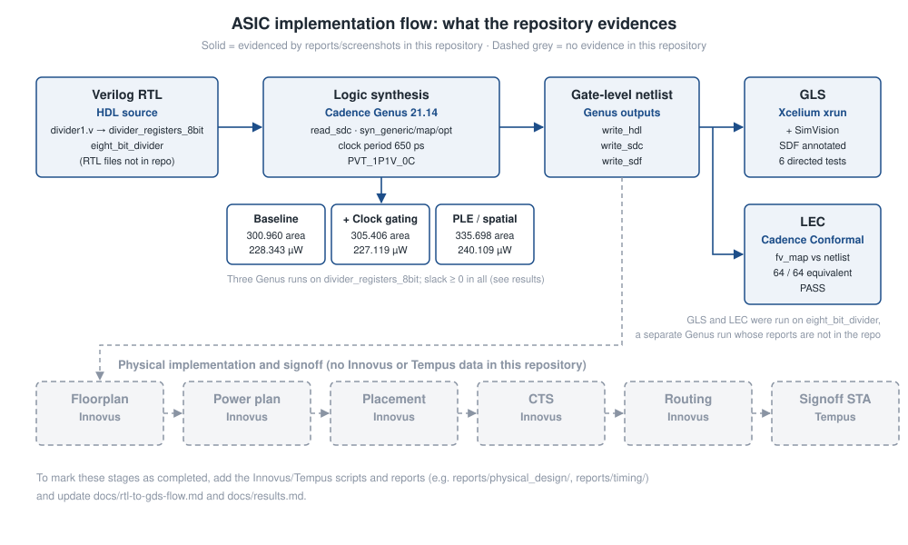

# FSM-Based 8-Bit Divider

An 8-bit unsigned sequential divider with a `start`/`done` handshake, taken through a Cadence ASIC front-end flow. The flow covers **logic synthesis in Genus** (baseline, clock-gated and physical-aware), **gate-level simulation with SDF back-annotation** in Xcelium, and **logical equivalence checking** in Conformal. Every number in this README links to a report or screenshot in the repository.


## Key Specifications

| Parameter | Value |
| --------- | ----- |
| Function | Unsigned integer division: quotient `q` and remainder `p` |
| Operand width | 8-bit dividend `x`, 8-bit divisor `y` |
| Architecture | Sequential, multi-cycle, `start` → `done` handshake |
| Latency (gate-level sim) | 9 rising clock edges from `start` sampled to `done` / result valid |
| Divide-by-zero (gate-level sim) | `q = 0`, `p = x`, `done` asserted |
| Flip-flops (`eight_bit_divider`) | 47 (Conformal LEC DFF compare points) |
| HDL | Verilog |
| Synthesis | Cadence Genus 21.14, clock constraint **650 ps** (≈ 1.54 GHz), slack ≥ 0 in all three runs |
| Gate-level simulation | Cadence Xcelium + SimVision, SDF-annotated, 6/6 directed tests correct |
| Equivalence check | Cadence Conformal LEC: 64/64 points equivalent, **PASS** |
| Physical design / signoff STA | Innovus / Tempus: *not available in the current repository* ([details](#evidence-status)) |


---

## Overview

Dividing in a single cycle with a combinational array costs one subtract stage per quotient bit, all in series. That makes it large and slow. A sequential divider reuses one arithmetic stage over several clock cycles. A small controller decides when to load operands, when to iterate and when to report the result. This project implements that trade-off at 8 bits and checks the result below RTL level:

- **Synthesis** under a tight clock constraint (650 ps), with a timing-budget breakdown that shows what actually limits the period.
- **Low-power synthesis**: automatic clock-gating insertion and its measured effect on power and area.
- **Physical-aware synthesis (PLE)**: how realistic wire modelling changes area and switching power.
- **Gate-level simulation** of the synthesized netlist with SDF delays, measuring clock-to-output delay.
- **Formal equivalence** between the synthesis tool's intermediate and final netlists.

> **Evidence status.** The repository was assembled from the project's EDA reports and screenshots. The **Verilog RTL and the SDC file are not yet included.** For that reason, state names, internal datapath structure and the exact algorithm are not claimed here. See [Evidence Status](#evidence-status).

## Why a Sequential (FSM-Controlled) Divider?

| Concern | Sequential divider (this design) | Fully combinational divider |
| ------- | -------------------------------- | --------------------------- |
| Arithmetic hardware | One iteration stage, reused every cycle | One subtract/compare stage per quotient bit, in series |
| Critical path | One iteration step | All stages in series |
| Latency | Multiple cycles (9 edges observed) | One cycle, but at a much longer clock period |
| Throughput | One result per multi-cycle operation | One result per (long) cycle |
| Control | Needs a controller: load, iterate, count, done | None |
| Area | Registers + one stage + counter/controller | Grows with the square of the operand width |

The right-hand column is the general textbook trade-off. No combinational version was built or measured in this project. The synthesis-study netlist (`divider_registers_8bit`) is small, at 91–106 cells and about 300–336 area units, which fits a sequential design.

## Cycle-by-Cycle Operation


*Redrawn from the gate-level SimVision waveform (10 ns testbench clock). This is a derived diagram, not raw simulator output.*

| Rising edge | Time | Port activity |
| ----------- | ---- | ------------- |
| E0 | 55 ns | `start` = 1 sampled; `done` low, `q`/`p` = 0 |
| 1 – 8 | 65–135 ns | Iteration in progress; no port changes |
| 9 | 145 ns | `done` ↑ (+47 ps), `q` = 4, `p` = 1 (+125 ps) |
| (held) | 155 ns | `done`, `q`, `p` held |
| E0′ | 165 ns | Next `start` sampled; `done` ↓, `q`/`p` cleared |

The project calls the divider an *8-cycle* design. The gate-level waveform shows **9** edges from `start`-sample to `done`, which matches 8 iteration cycles plus one cycle for load or result registration. The RTL is needed to confirm which edge does what. Details are in [docs/fsm.md](docs/fsm.md).

## FSM Operation

The controller's states are defined in the RTL, which is not yet in the repository, so **no state names are given here**. The control behaviour visible at the ports is:

1. **Wait.** Results from the previous operation are held and `done` stays high until a new `start` is sampled.
2. **Accept.** On the edge that samples `start`, `done` falls and `q`/`p` clear.
3. **Iterate.** The next 8 edges show no port activity while the divider iterates internally.
4. **Complete.** On the 9th edge, `q` and `p` load the result and `done` rises.
5. **Zero divisor.** If `y = 0`, the result `q = 0`, `p = x` appears on the sampling edge itself and `done` never falls. The controller handles this case separately.

The state-level table and diagram are left as a fill-in section in [docs/fsm.md](docs/fsm.md).

## Division Algorithm

**Not confirmed from source.** An 8-bit quotient produced after a fixed multi-cycle latency is consistent with a radix-2 shift/subtract divider (restoring or non-restoring) that resolves one quotient bit per cycle. Register names in the synthesis-study netlist (`A_reg`, `Q_reg`, `count_reg`) fit an accumulator/quotient/counter structure. This README claims a specific algorithm only once the RTL is added. See [docs/architecture.md](docs/architecture.md#4-division-algorithm).

## Interface

From the port connections in [`tb/tb_eight_bit_divider.v`](tb/tb_eight_bit_divider.v), with behaviour as seen in gate-level simulation:

| Signal | Direction | Width | Description |
| ------ | --------- | ----: | ----------- |
| `clk` | input | 1 | Clock; outputs update on the rising edge |
| `rst` | input | 1 | Reset, held high at start of simulation (active-high in use) |
| `start` | input | 1 | One-cycle pulse that starts a division |
| `x` | input | 8 | Dividend (unsigned) |
| `y` | input | 8 | Divisor (unsigned) |
| `q` | output | 8 | Quotient |
| `p` | output | 8 | Remainder |
| `done` | output | 1 | High when `q`/`p` are valid; held until the next `start` |

## Timing and Latency

| Quantity | Value | Kind |
| -------- | ----- | ---- |
| Synthesis clock constraint (`divider_registers_8bit`) | 650 ps (≈ 1.54 GHz) | **Constraint met in Genus** (slack 0 / 1 / 3 ps) |
| Latency (`eight_bit_divider`) | 9 clock edges, `start`-sample → `done` | **Measured** in gate-level simulation |
| Clock → `done` | 47 ps | **Measured** (SDF-annotated GLS) |
| Clock → `q`/`p` | 125 ps | **Measured** (SDF-annotated GLS) |
| GLS testbench clock | 10 ns | Functional test clock, not a performance target |
| 1 ns target, post-route timing | Not available in the current repository | — |

The divider holds one operation at a time, so at least 9 cycles pass between results. The 650 ps constraint and the 9-cycle latency come from **different netlists** (see [below](#a-note-on-the-two-netlists)), so no end-to-end division time is calculated here.

## Verification


- **Gate-level simulation.** The testbench applies six directed operand pairs through a `run_division` task. Each call drives `x`/`y`, pulses `start`, waits for `done` and prints the result. The netlist is back-annotated with Genus-generated SDF at the MAXIMUM corner. All five non-zero divisions match `x / y` and `x % y`. Divide-by-zero returns `q = 0`, `p = x`. The testbench is **not self-checking**: results were checked by waveform inspection.
- **Logical equivalence.** Conformal LEC compared Genus's intermediate `fv_map` netlist with the final netlist. All 64 compare points (17 outputs + 47 flip-flops) are equivalent. This proves that synthesis optimisation kept the logic function. It is not an RTL-to-netlist proof.

| x | y | q | p | Correct |
| -: | -: | -: | -: | :-----: |
| 13 | 3 | 4 | 1 | ✔ |
| 100 | 7 | 14 | 2 | ✔ |
| 50 | 5 | 10 | 0 | ✔ |
| 200 | 15 | 13 | 5 | ✔ |
| 77 | 1 | 77 | 0 | ✔ |
| 55 | 0 | 0 | 55 | defined zero-divisor output |

Full details: [docs/verification.md](docs/verification.md).

## Example Simulation


*Cadence SimVision, gate-level run of `eight_bit_divider` (0–665 ns). Signals: `clk`, `rst`, dividend `x[7:0]`, divisor `y[7:0]`, `start`, `done`, quotient `q[7:0]`, remainder `p[7:0]` (hex). Each `start` pulse leads to a `done` pulse 9 clock edges later carrying the result. The cursor marks the first result, 13 ÷ 3 = 4 r 1. The last operation is 55 ÷ 0.*

Zoomed captures at the 145 ns edge: [clock → `done` = 47 ps](assets/gls-clk-to-done.png) · [clock → `q`/`p` = 125 ps](assets/gls-clk-to-output.png).

## RTL-to-GDS Flow



Solid stages have reports or screenshots in this repository. Dashed stages (Innovus place-and-route, Tempus signoff) have **none in the current repository**, so no results are claimed for them. Details are in [docs/rtl-to-gds-flow.md](docs/rtl-to-gds-flow.md).

## Synthesis

Cadence Genus 21.14 on module `divider_registers_8bit`, operating condition `PVT_1P1V_0C`, multi-Vt standard-cell libraries, `syn_generic` → `syn_map` → `syn_opt` at medium effort. SDC: 650 ps clock, 250 ps source and 250 ps network latency (ideal), 100 ps uncertainty, 500 ps input delay.

| Metric | Baseline | + Clock gating | PLE (spatial) |
| ------ | -------: | -------------: | ------------: |
| Total area | 300.960 | 305.406 | 335.698 |
| Cells (seq / comb) | 99 (38 / 61) | 91 (39 / 52) | 106 (39 / 67) |
| Total power | 228.343 µW | 227.119 µW | 240.109 µW |
| Leakage power | 0.141 µW | 0.129 µW | 0.117 µW |
| Worst setup slack @ 650 ps | 0 ps | 1 ps | 3 ps |
| Gated flip-flops | 0 / 38 | 8 / 38 | 8 / 38 |

What the numbers show:

- **What limits the clock.** The worst path is `load` → `count_reg[3]`, and its budget is `650 = 500 (input delay) + 37 (logic) + 13 (setup) + 100 (uncertainty)`. Only 37 ps is logic delay. The minimum period here is set by the SDC I/O budget, not by internal logic depth.
- **Clock gating** inserted one ICG over 8 flops (25 % average toggle saving). Total power dropped by 0.54 % and area rose by 1.48 %. The gain is small because register internal power dominates and only 21 % of flops had a gateable enable.
- **PLE** replaces wireload modelling with spatial wire estimates. That adds 76.205 units of net area and raises switching power by 37 %, which gives a more realistic pre-layout estimate.

Report screenshots: [`reports/synthesis/`](reports/synthesis/). Full table with sources: [docs/results.md](docs/results.md).

## Physical Design

Not available in the current repository. The project description mentions Cadence Innovus, but no floorplan, placement, CTS, routing reports or layout screenshots are included, so this README makes no physical-design claims. [docs/rtl-to-gds-flow.md](docs/rtl-to-gds-flow.md#4-physical-implementation-innovus-and-signoff-sta-tempus) lists what to add.

## Static Timing Analysis

The setup timing in this repository is **Genus's pre-layout timing** at 650 ps (above): 0 ps worst slack in the baseline run, no violating paths in any run. **Tempus signoff STA, hold analysis and post-route timing are not available in the current repository.**

## Results

| Category | Result | Source |
| -------- | ------ | ------ |
| Functionality | 5/5 non-zero divisions correct in SDF-annotated GLS; divide-by-zero gives `q = 0`, `p = x` | GLS waveform |
| Equivalence | 64/64 points equivalent, PASS | Conformal LEC |
| Latency | 9 clock edges, `start` → `done` | GLS waveform |
| Clock-to-output | 47 ps (`done`), 125 ps (`q`/`p`) | GLS waveform |
| Clock constraint | 650 ps met (0 ps slack) in Genus | `report_timing` |
| Area | 300.960 (baseline), 305.406 (clock-gated), 335.698 (PLE) | `report_area` |
| Power | 228.343 / 227.119 / 240.109 µW | `report_power` |
| Physical implementation | Not available in the current repository | — |

Every value with its source file: [docs/results.md](docs/results.md).

### A note on the two netlists

The synthesis study was run on module `divider_registers_8bit` (38 flip-flops). GLS and LEC were run on `eight_bit_divider` (47 flip-flops), whose own synthesis reports are not in the repository. They are kept separate throughout, and no number from one is attributed to the other.

## Repository Structure

```text
.
├── README.md
├── assets/                 Diagrams (SVG) and gate-level waveform captures (PNG)
├── docs/
│   ├── architecture.md     Interface, sequential structure, what the evidence shows
│   ├── fsm.md              Observed control sequencing and cycle table
│   ├── verification.md     GLS testbench, results, waveforms, LEC
│   ├── rtl-to-gds-flow.md  Flow stages, Genus settings, evidence status
│   └── results.md          Every number with its source report
├── reports/
│   ├── synthesis/          Genus timing/area/power/QoR/clock-gating reports (3 runs)
│   └── verification/       Conformal LEC compare and verification reports
├── rtl/                    Placeholder: RTL to be added
├── constraints/            Placeholder: SDC to be added
├── scripts/
│   ├── gls/run_gls         Xcelium gate-level simulation command
│   └── lec/divider_lec.do  Conformal LEC dofile
└── tb/
    └── tb_eight_bit_divider.v   Gate-level simulation testbench
```

Report files are cropped screenshots of the tool output, with no edits to the report content.

## Reproducibility

All flows need a licensed Cadence environment and the standard-cell libraries used in the original runs. Neither is included here.

**Gate-level simulation** (Cadence Xcelium):

```sh
xrun -timescale 1ns/10ps -f filelist_gls -access +rwc -gui
```

`filelist_gls` (not included) must list the synthesized netlist, the standard-cell Verilog models and `tb/tb_eight_bit_divider.v`. The testbench expects the SDF at `./outputs/delays.sdf`.

**Equivalence check** (Cadence Conformal): run [`scripts/lec/divider_lec.do`](scripts/lec/divider_lec.do) in a Conformal LEC session. It expects `./lib/verilog/slow_vdd1v0_basicCells*.v`, Genus's `fv/eight_bit_divider/fv_map.v.gz`, and `divider_netlist.v`.

**Synthesis** (Cadence Genus): the full script is not in the repository. The visible excerpt and all settings are in [docs/rtl-to-gds-flow.md](docs/rtl-to-gds-flow.md#11-script). Synthesis cannot be reproduced until the RTL and SDC are added.

**Physical design and STA**: not available in the current repository.

## Technical Learnings

- **Sequential arithmetic with a handshake.** Operation is triggered by `start`, completion is signalled by `done`, results are held until the next request, and the zero-divisor case is handled separately.
- **Reading a timing report as a budget.** The 650 ps limit splits into input delay, logic, setup and uncertainty. That shows the constraint, not the logic, was the bottleneck.
- **Low-power synthesis trade-offs.** Clock gating works only on registers with a usable enable and a wide enough bank. Here 21 % of flops qualified, so power fell by 0.5 % at a cost of 1.5 % area.
- **Wireload versus physical-aware estimation.** PLE adds net area and switching power that zero-wireload synthesis leaves out.
- **Gate-level simulation with SDF.** Measured clock-to-output delays (47 / 125 ps) confirm the netlist works with real cell delays, not only zero-delay logic.
- **Formal equivalence.** Running and reading a Conformal LEC flow, and knowing what an `fv_map`-vs-netlist check does and does not prove.

## Challenges and Design Trade-offs

- **Latency versus hardware.** The design accepts a 9-edge latency in exchange for a small arithmetic datapath. The synthesis-study netlist is about 100 cells.
- **I/O constraints dominate at aggressive periods.** With a 500 ps input delay, a 650 ps clock leaves the design only 37 ps of logic budget on input paths. Tightening the period further would need relaxed I/O constraints or registered inputs, not faster internal logic.
- **Clock gating's limited reach.** 28 of 38 flops had no enable that Genus could extract, so most of the clock power stayed ungated.
- **Area versus power under PLE.** Cell area under PLE was 15 % lower, but realistic wiring added more than that back in net area.

## Limitations

- **RTL and SDC are not in the repository.** This README makes no claim about state names, internal datapath or the exact algorithm.
- Unsigned operands only (8-bit `x`, `y`). Signed division is not shown.
- Divide-by-zero returns `q = 0`, `p = x` with no separate error flag on the interface.
- Verification is 6 directed vectors with manual checking: no self-checking, no exhaustive or random testing, no coverage.
- LEC compares Genus's intermediate netlist to the final netlist, not the RTL to the netlist.
- One result per 9+ cycles. There is no pipelining or overlap of operations.
- No Innovus, Tempus, hold-timing, post-route power or layout evidence in this repository.

## Future Improvements

**Implemented (evidenced here):** 8-bit sequential divider with `start`/`done` handshake; Genus synthesis at 650 ps; clock-gated and PLE synthesis variants; SDF-annotated gate-level simulation; Conformal LEC.

**Potential future work:**
- Add the RTL and SDC, and complete the FSM state table and diagram ([docs/fsm.md](docs/fsm.md)).
- Make the testbench self-checking and exhaustive over all 65,280 non-zero-divisor pairs, and add protocol tests (`start` during an operation, reset during an operation).
- Run RTL-to-netlist LEC.
- Parameterise the operand width.
- Add signed division and an explicit divide-by-zero flag.
- Use a radix-4 or SRT iteration for lower latency, or a pipelined divider for one result per cycle.
- Register the inputs to decouple the core clock from the 500 ps I/O budget.
- Add Innovus place-and-route and Tempus signoff STA (setup and hold), with layout screenshots and post-route power.

## Evidence Status

| Item | In repository |
| ---- | ------------- |
| GLS testbench, run command, LEC dofile | Yes |
| Genus timing/area/power/QoR/clock-gating reports (3 runs) | Yes (screenshots) |
| GLS waveforms, LEC results | Yes (screenshots) |
| Verilog RTL | **No.** Add to `rtl/` |
| SDC constraints file | **No.** Add to `constraints/` |
| Full Genus scripts | **No.** Excerpt only |
| 1 ns timing target | **No evidence.** The only constraint in evidence is 650 ps |
| Innovus / Tempus scripts, reports, layout | **No** |

## Conclusion

This project implements an 8-bit unsigned divider as a sequential, multi-cycle circuit. A `start` pulse begins an operation and the quotient and remainder appear with `done` nine clock edges later. Divide-by-zero returns a defined result immediately. The synthesis study (`divider_registers_8bit`) met a 650 ps clock in Cadence Genus with zero or positive slack. Clock-gating and physical-aware runs quantified their power, area and wiring effects. A timing-budget breakdown showed that the clock limit came from the I/O constraints rather than logic depth. The `eight_bit_divider` netlist simulated correctly with SDF-annotated delays (47 ps clock-to-`done`, 125 ps clock-to-output) and passed formal equivalence on all 64 compare points. The remaining steps are clear: add the RTL and constraints, strengthen verification, and document the place-and-route and signoff stages.

The project shows hands-on work across the front half of an ASIC flow: sequential RTL, constraints, synthesis trade-off analysis, gate-level simulation and formal equivalence.
