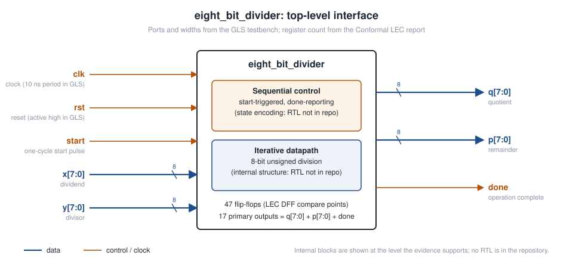

# Architecture

> **Scope of this document.** The Verilog RTL is not in this repository yet. Everything here comes from the evidence that is present: the gate-level testbench (port list), the gate-level waveforms (cycle behaviour), the Conformal LEC report (register and output counts) and the Genus reports (register names, cell counts). Anything that would need the RTL source to confirm is marked as such.



## 1. Function

`eight_bit_divider` computes an 8-bit unsigned integer quotient and remainder:

```text
q = floor(x / y)        p = x mod y        for y ≠ 0
```

All six directed tests in gate-level simulation match this behaviour (see [verification.md](verification.md)). For `y = 0` the netlist returns `q = 0`, `p = x`.

## 2. Interface

Taken from the port connections in [`tb/tb_eight_bit_divider.v`](../tb/tb_eight_bit_divider.v):

| Signal | Direction | Width | Description (as exercised by the testbench and waveform) |
| ------ | --------- | ----: | -------------------------------------------------------- |
| `clk` | input | 1 | Clock. Results update on its rising edge. The testbench uses a 10 ns period. |
| `rst` | input | 1 | Reset. Driven high for the first 50 ns, then low. Active-high in use. Synchronous or asynchronous: needs the RTL. |
| `start` | input | 1 | Starts an operation. Held high for one clock period and sampled on a rising edge. |
| `x` | input | 8 | Dividend (unsigned). |
| `y` | input | 8 | Divisor (unsigned). |
| `q` | output | 8 | Quotient. |
| `p` | output | 8 | Remainder. |
| `done` | output | 1 | Goes high on the edge where `q`/`p` become valid. Stays high until the next `start` is sampled. |

LEC cross-check: 17 primary outputs = 8 (`q`) + 8 (`p`) + 1 (`done`).

## 3. Sequential structure (what the evidence shows)

| Property | Evidence |
| -------- | -------- |
| Multi-cycle, iterative operation | Results appear 9 rising edges after `start` is sampled ([cycle-operation.svg](../assets/cycle-operation.svg)) |
| 47 flip-flops | Conformal LEC: 47 DFF compare points |
| Outputs change only at clock edges | In the waveform, `q`, `p` and `done` change only 47–125 ps after a rising edge. This is consistent with registered outputs. |
| Output clear on new operation | `q`, `p` return to `0x00` and `done` falls on the edge that samples a new `start` |
| Zero-divisor path | With `y = 0`, the result (`q = 0`, `p = x`) appears on the sampling edge and `done` stays high |

There are 16 operand bits (`x`, `y`), 16 output bits (`q`, `p`) and one `done` bit. That leaves 47 − 33 = 14 flip-flops if the operands and outputs are each held in their own registers. Those would cover the iteration counter, the controller state and any working registers. How the 47 flops are actually split is **not known without the RTL**.

## 4. Division algorithm

**Not confirmed by repository evidence.** An 8-bit result after a fixed multi-cycle latency is consistent with a radix-2 iterative divider (restoring or non-restoring shift/subtract), which resolves one quotient bit per cycle. This repository does not claim either algorithm until the RTL is added.

## 5. The synthesis-study module `divider_registers_8bit`

The Genus synthesis study (power optimisation and PLE) was run on a different module, `divider_registers_8bit` from `divider1.v`. Its reports show:

| Property | Value | Source |
| -------- | ----- | ------ |
| Flip-flops | 38 | clock-gating report |
| Register names on reported critical paths | `count_reg[3]`, `A_reg[10]`, `Q_reg[0]` | `report_timing.png` (three runs) |
| Ports seen as path startpoints | `load`, `rst` | `report_timing.png` |
| Clock net fan-out | 38 (`clk`) | baseline `report_qor.png` |

The names `A_reg`, `Q_reg` and `count_reg` suggest an accumulator, a quotient register and an iteration counter. Bit index `[10]` shows that `A_reg` is at least 11 bits wide. These are register names only. The full datapath of `divider_registers_8bit` cannot be described without `divider1.v`.

## 6. To complete this document

Add the RTL to [`rtl/`](../rtl/), then fill in:
1. The datapath registers and their widths.
2. The arithmetic block (subtractor/adder width, how the quotient bit is formed).
3. The FSM states and transitions (see [fsm.md](fsm.md)).
4. The exact cycle allocation (which of the 9 edges does load, iterate and finish).
5. How `eight_bit_divider` relates to `divider_registers_8bit`.
