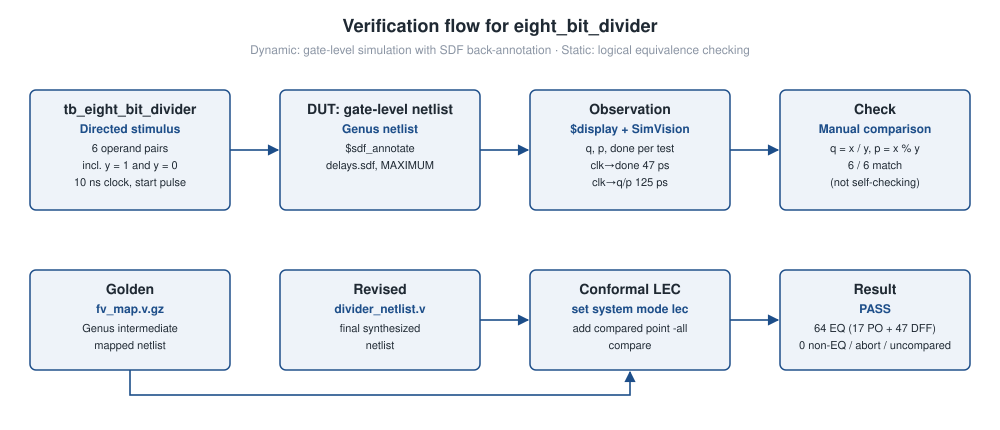
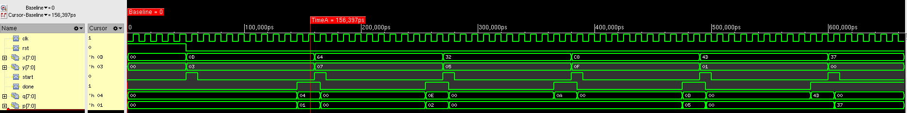
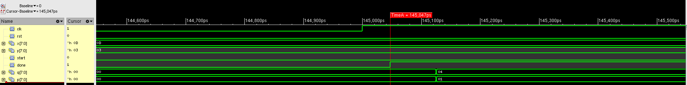
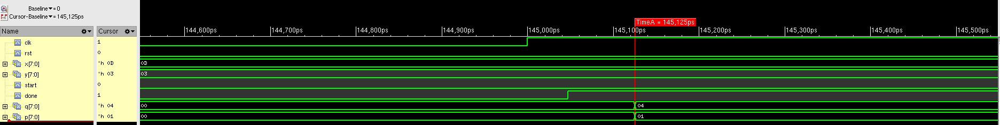
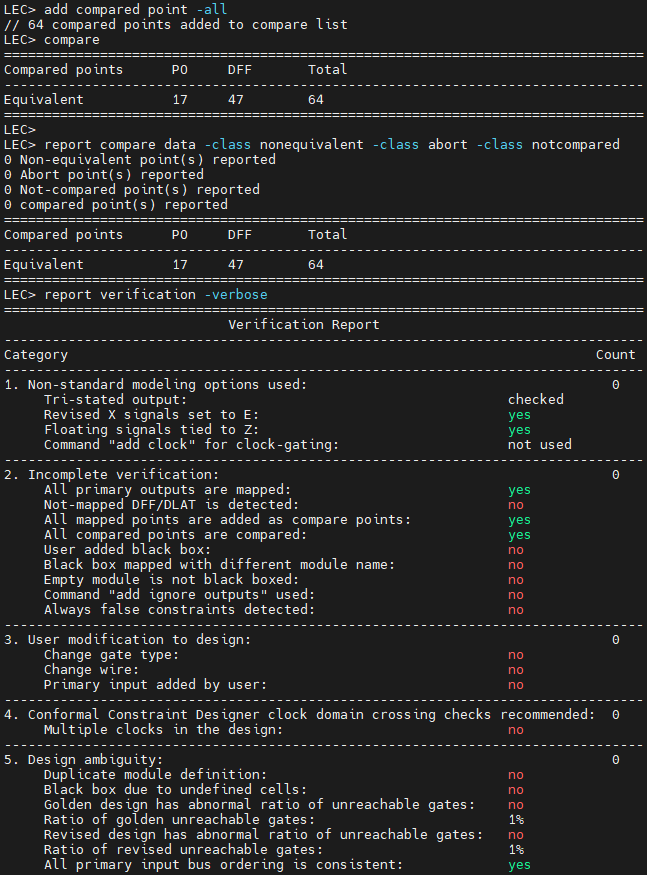

# Verification

Two verification methods are documented for `eight_bit_divider`:

1. **Gate-level simulation (GLS)** of the synthesized netlist with SDF back-annotation (Cadence Xcelium + SimVision).
2. **Logical equivalence checking (LEC)** between Genus's intermediate mapped netlist and the final netlist (Cadence Conformal).



No RTL-level simulation results, functional coverage or formal property checks are in the repository.

---

## 1. Gate-level simulation

### 1.1 Testbench

[`tb/tb_eight_bit_divider.v`](../tb/tb_eight_bit_divider.v)

| Aspect | Implementation |
| ------ | -------------- |
| Clock | `always #5 clk = ~clk`. That is a 10 ns period with `-timescale 1ns/10ps`. |
| Reset | `rst = 1` for 50 ns, then `0` |
| Stimulus | Directed. A `run_division(dividend, divisor)` task drives `x`, `y` and a one-cycle `start` pulse on falling clock edges. |
| Completion | `wait(done)`, then one more rising edge before sampling |
| Result reporting | `$display` of dividend, divisor, quotient, remainder |
| Delay annotation | `$sdf_annotate("./outputs/delays.sdf", …, "MAXIMUM")` |
| Self-checking | **No.** Results are printed and were checked by inspecting the waveform. |

Changes made while transcribing from the lab report: `End` → `end` (an auto-capitalisation artefact), and the `$sdf_annotate` scope changed from `.DUT` to `.dut` to match the instance name, because Verilog hierarchical names are case-sensitive. The original run's SDF log is not in the repository. As a result, it cannot be confirmed whether annotation succeeded under the original `.DUT` spelling.

### 1.2 Test vectors and results

| # | x | y | Purpose | q (observed) | p (observed) | Expected | Result |
| - | -: | -: | ------- | -----------: | -----------: | -------- | ------ |
| 1 | 13 | 3 | Basic, non-zero remainder | 4 | 1 | 4 r 1 | Pass |
| 2 | 100 | 7 | Multi-bit quotient | 14 | 2 | 14 r 2 | Pass |
| 3 | 50 | 5 | Exact division | 10 | 0 | 10 r 0 | Pass |
| 4 | 200 | 15 | Dividend > 127 (MSB set) | 13 | 5 | 13 r 5 | Pass |
| 5 | 77 | 1 | Divisor = 1 (quotient = dividend) | 77 | 0 | 77 r 0 | Pass |
| 6 | 55 | 0 | Divide by zero | 0 | 55 | undefined | Defined output: q = 0, p = x |

Values were read from the SimVision waveform ([`assets/gls-waveform-overview.png`](../assets/gls-waveform-overview.png)), shown in hex there.

### 1.3 Waveform evidence



*SimVision capture of the full 665 ns gate-level run. Signals top to bottom: `clk`, `rst`, `x[7:0]`, `y[7:0]`, `start`, `done`, `q[7:0]`, `p[7:0]`. Each `start` pulse is followed 9 clock edges later by a `done` pulse with the quotient in `q` and remainder in `p`. The cursor (156,397 ps) shows the first result, `q = 0x04`, `p = 0x01` (13 ÷ 3). The last operation (55 ÷ 0) returns `q = 0x00`, `p = 0x37` without deasserting `done`.*



*Zoom at the 145 ns rising edge. `done` rises at 145,047 ps, giving a **47 ps** clock-to-`done` delay.*



*Same edge. `q` and `p` change to `0x04`/`0x01` at 145,125 ps, giving a **125 ps** clock-to-output delay.*

These delays come from the gate-level netlist with SDF back-annotation at the "MAXIMUM" delay corner. They are cell and interconnect estimates from synthesis, not post-route values.

### 1.4 Running GLS

```sh
xrun -timescale 1ns/10ps -f filelist_gls -access +rwc -gui
```

([`scripts/gls/run_gls`](../scripts/gls/run_gls))

Requirements, none of which are in the repository:
- A licensed Cadence Xcelium installation.
- `filelist_gls`, listing the synthesized netlist, the standard-cell Verilog models and `tb/tb_eight_bit_divider.v`.
- `./outputs/delays.sdf` written by Genus.

### 1.5 Local checks done for this repository

The transcribed testbench compiles cleanly with Icarus Verilog 12. To confirm the stimulus timing, it was run against a throwaway behavioural stub that reproduces only the port timing seen in the waveform. The stub was not committed and is not a design. The stub run gives the same event times as the original GLS capture (`start` at 50/160/270/380/490/600 ns, first `done` at 145 ns, `$finish` at 665 ns). No simulation of the actual design was possible, because neither the RTL nor the netlist is in the repository.

---

## 2. Logical equivalence check

Dofile: [`scripts/lec/divider_lec.do`](../scripts/lec/divider_lec.do)

| Item | Value |
| ---- | ----- |
| Tool | Cadence Conformal LEC |
| Library | `slow_vdd1v0_basicCells{,_lvt,_hvt}.v` |
| Golden | `fv/eight_bit_divider/fv_map.v.gz`, the intermediate mapped netlist that Genus writes for formal verification |
| Revised | `divider_netlist.v`, the final netlist |
| Flatten options | `-seq_constant`, `-seq_constant_x_to 0`, `-nodff_to_dlat_zero`, `-nodff_to_dlat_feedback`, `-hier_seq_merge`, `-gated_clock` |
| Compare points | 64 (17 PO + 47 DFF), all equivalent |
| Non-equivalent / abort / not compared | 0 / 0 / 0 |
| Result | **PASS** |



*Conformal LEC: 64 compare points mapped and compared, all equivalent.*

**What this LEC proves and what it does not.** The golden design is Genus's `fv_map` netlist, not the RTL. This run shows that Genus's later optimisation steps kept the logic function of its own intermediate netlist. It does **not** on its own prove that the RTL matches the netlist. An RTL-to-netlist check would load the RTL as golden. That is a recommended addition once the RTL is in the repository.

---

## 3. Gaps and recommended additions

| Gap | Recommendation |
| --- | -------------- |
| No self-checking | Compare `q`/`p` against `x / y` and `x % y` in the testbench and count failures |
| 6 directed vectors | Exhaustive test: all 65,280 non-zero-divisor pairs take about 7 ms of simulated time (65,280 × ~11 cycles × 10 ns) |
| No RTL simulation in evidence | Run the same testbench on the RTL before synthesis |
| No back-to-back `start` or mid-operation `start` tests | Add protocol tests for `start` held high, `start` during an operation, and reset during an operation |
| LEC golden = `fv_map` | Add an RTL-vs-netlist LEC run |
| No coverage | Add code/FSM coverage collection in Xcelium |
