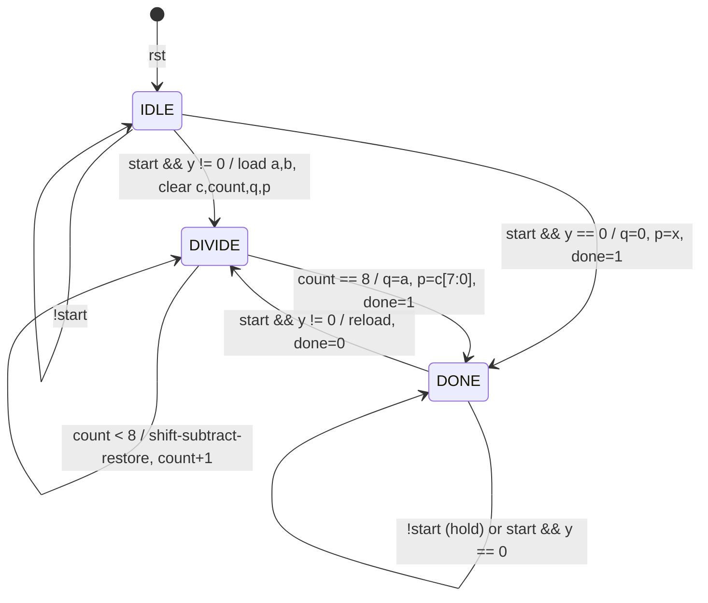

# RTL Design

File: [`rtl/divider.v`](../rtl/divider.v) · Module: `eight_bit_divider` · Language: Verilog-2001

## 1. Provenance and integrity

- This is the only divider RTL in the repository. It is the module that Genus elaborates (`elaborate eight_bit_divider`), Conformal checks (`-root eight_bit_divider`), Innovus places (`Design Name: eight_bit_divider`) and Tempus analyses. It is also the module both testbenches instantiate.
- It was moved from `RTL & Verification /divider_8bit.v` to `rtl/divider.v`. The content is **byte-identical**: no edits were made during consolidation. It was renamed because the Genus script reads `read_hdl "divider.v"`.
- The source repository `RTL-of-8-bit-Divider` contained no RTL (its `rtl/` folder held only a placeholder README), so there was no second version to reconcile.
- The legacy Genus reports for `divider_registers_8bit` come from a **different** RTL file (`divider1.v`) with a different interface (it has a `load` input). That file is not available. See [synthesis.md](synthesis.md#4-legacy-study-divider_registers_8bit).

## 2. Code structure

```verilog
module eight_bit_divider (input clk, rst, start, input [7:0] x, y,
                          output reg [7:0] q, p, output reg done);
  reg [7:0] a, b;  reg [8:0] c;  reg [3:0] count;  reg [1:0] state;
  reg [8:0] c_next; reg [7:0] a_next; reg done_next; reg [1:0] state_next; reg [3:0] count_next;
  localparam IDLE = 2'b00, DIVIDE = 2'b01, DONE = 2'b10;
  always @(posedge clk or posedge rst)
    if (rst) ... all registers ← 0, state ← IDLE
    else begin
      *_next = current values;                // defaults (blocking)
      case (state) ... compute *_next; q/p/b updated directly (non-blocking)
      a <= a_next; c <= c_next; count <= count_next; state <= state_next; done <= done_next;
    end
endmodule
```

The `*_next` variables are assigned with blocking statements inside the clocked block, so they synthesise to combinational logic, not flops. `q`, `p` and `b` are written with non-blocking assignments directly inside the `case`.

## 3. FSM

| From | Condition | To | Register updates |
| ---- | --------- | -- | ---------------- |
| (reset) | `rst = 1` | `IDLE` | all registers ← 0 |
| `IDLE` | `!start` | `IDLE` | `done ← 0` |
| `IDLE` | `start && y == 0` | `DONE` | `q ← 0`, `p ← x`, `done ← 1` |
| `IDLE` | `start && y != 0` | `DIVIDE` | `a ← x`, `b ← y`, `c ← 0`, `count ← 0`, `q ← 0`, `p ← 0`, `done ← 0` |
| `DIVIDE` | `count < 8` | `DIVIDE` | one restoring step on `a`, `c`; `count ← count + 1` |
| `DIVIDE` | `count == 8` | `DONE` | `q ← a`, `p ← c[7:0]`, `done ← 1` |
| `DONE` | `!start` | `DONE` | hold (`done = 1`) |
| `DONE` | `start && y == 0` | `DONE` | `q ← 0`, `p ← x`, `done ← 1` |
| `DONE` | `start && y != 0` | `DIVIDE` | same load as from `IDLE`, `done ← 0` |
| any other (`2'b11`) | — | `IDLE` | `default` branch |



Observations:

- `IDLE` is reached only from reset. After the first operation the FSM alternates between `DONE` and `DIVIDE`. This is why IMC reports FSM coverage of 87.5 % (state-transition coverage 6/7, 85.71 %) for the directed test.
- `start` is not examined in `DIVIDE`. A second request during a division is silently dropped. The exhaustive testbench checks this.
- If `start` is held high in `DONE`, a new division starts on every pass through `DONE`.

## 4. Cycle trace (RTL, 13 ÷ 3)

Produced with Icarus Verilog by probing `dut.state`, `dut.count`, `dut.a` and `dut.c`. Edge 0 is the rising edge that samples `start = 1`.

| Edge | state after | count | a | c | q | p | done |
| ---: | ----------- | ----: | - | -: | -: | -: | :--: |
| 0 | DIVIDE | 0 | 0000_1101 | 0 | 0 | 0 | 0 |
| 1 | DIVIDE | 1 | 0001_1010 | 0 | 0 | 0 | 0 |
| 2 | DIVIDE | 2 | 0011_0100 | 0 | 0 | 0 | 0 |
| 3 | DIVIDE | 3 | 0110_1000 | 0 | 0 | 0 | 0 |
| 4 | DIVIDE | 4 | 1101_0000 | 0 | 0 | 0 | 0 |
| 5 | DIVIDE | 5 | 1010_0000 | 1 | 0 | 0 | 0 |
| 6 | DIVIDE | 6 | 0100_0001 | 0 | 0 | 0 | 0 |
| 7 | DIVIDE | 7 | 1000_0010 | 0 | 0 | 0 | 0 |
| 8 | DIVIDE | 8 | 0000_0100 | 1 | 0 | 0 | 0 |
| 9 | DONE | 8 | 0000_0100 | 1 | **4** | **1** | **1** |

Edges 1–8 are the eight iterations. On edge 9 the FSM sees `count == 8` and registers the result. In SDF-annotated gate-level simulation this edge is at 145 ns: `done` rises 47 ps and `q`/`p` change 125 ps after it ([verification.md](verification.md#4-gate-level-simulation)).

## 5. Lint / synthesis sanity check (Yosys 0.33)

`make -C verification lint` runs `synth -top eight_bit_divider; check -assert; stat`:

- `CHECK` pass: 0 problems.
- 236 generic cells, including **47 `$_DFFE_PP0P_`** (flip-flops with enable and asynchronous active-high reset). The 48th declared bit, `c[8]`, is removed as a constant.

These generic-cell counts come from Yosys's technology-independent library. They are not comparable to Genus's mapped-cell counts.
